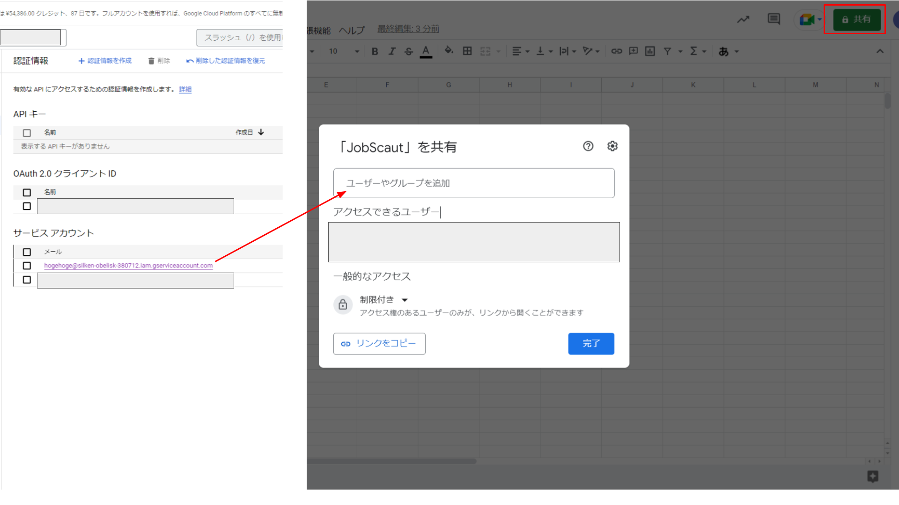

# JobScoutCrawler

## 概要
このリポジトリのコードはPaizaとマイナビから受け取ったスカウトをスクレイピングし、その内容をGoogle Spread SheetのAPIを用いてスプレッドシートに書き込むプログラムです。

## 開発環境
このコードはPython3を使って開発しました。
スクレイピングにはSelenium、HTMLの解析にはBeautifulSoupを使用しています。
また、スプレッドシートへの出力にはGoogle Sheets APIを利用しています。

## 使い方

このスクレイピングプログラムを使用するには、次の作業が必要です。

1. [Google Sheets APIを有効にする](#apiの有効化)
2. [認証情報ファイルを取得する](#認証情報ファイルの取得)
3. [スプレッドシートを共有する](#スプレッドシートの共有)

詳細な手順はそれぞれの項目を参照してください

作業が完了したら、次の手順に従ってプログラムを実行してください。

1. 認証情報ファイルを「gspread_credentials.json」という名前で保存し、「private」フォルダと同じ階層に置きます。
2. 「private」フォルダ内の「settings.json」の"spread_sheet_name"の項目をスプレッドシートのファイル名に、"work_sheet_name"の項目をシート名に書き換えます。
3. 「private」フォルダ内の「settings.json」の"load_paiza"の項目をtrueにするとpaizaからスカウトを取得するようになります。同様に"load_mynavi"の項目をtrueにするとマイナビからスカウトを取得するようになります。
4. main.pyを実行することで、スクレイピングとSpread Sheetsへの書き込み処理が自動的に実行されます。なお、初回実行時には、各サイトのログインに使用するメールアドレスとパスワードの入力が必要です。

処理が成功すると指定したスプレッドシートに以下のように情報が書き込まれます。

### APIの有効化
スプレッドシートAPIを使用できる状態にするために各種APIの有効化の方法を記します。

1. Google Cloud Platformのページを開きます。
2. 右上の「無料で利用開始」ボタンをクリックします。

3. 左上のハンバーガーメニューから「APIとサービス/有効なAPIとサービス」を選択します。

4. 中央上部の「APIとサービスの有効化」を選択します。

5. Google Workspaceの欄からGoogle Drive APIとGoogle Sheets APIを選択し「管理ボタン」をクリックします

### 認証情報ファイルの取得
Google Cloud PlatformのGoogle Sheets APIの認証情報の取得方法を記します。

1. Google Cloud Platformのページを開きます。
2. 右上の「無料で利用開始」ボタンをクリックします。

3. 左上のハンバーガーメニューから「APIとサービス/認証情報」を選択します。

4. 中央の「認証情報を作成/サービスアカウント」を選択します。

5. 適当にサービスアカウント名を記入し、「完了」をクリックします。

6. 認証情報のページに追加されたサービスアカウントの項目をクリックし、メールの部分を選択します。  

7. タブからキーを選択し、「鍵を追加/新しい鍵を作成」をクリックします。

8. ポップアップが表示されたら、キーのタイプをJSONにして「作成」をクリックします。これにより、認証ファイルが自動的にダウンロードされます。

### スプレッドシートの共有
APIがGoogle Spread Sheetを操作できるようにする設定方法を記します。

1. スプレッドシートを新規作成します。
2. 右上の共有ボタンをクリックします。
3. 中央の「ユーザーやグループを追加」欄に認証情報のサービスアカウントの欄に表示されているメールアドレスを入力します。

## 注意事項
プログラムと同じ階層にあるprivateフォルダには、ログイン情報やAPI認証情報などの非公開情報が保存されます。
したがって、privateフォルダに保存されている情報は、外部に漏洩しないように、適切に保管することが必要です。

スクレイピングは、サーバーに負荷をかけることがあるため、実行回数には注意が必要です。
使用頻度は一日に数回程度の常識の範囲内に留め、スクレイピング先のサイトに対して迷惑がかからないようにしてください。
